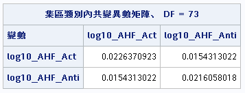
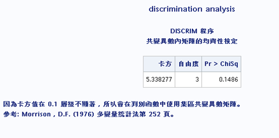
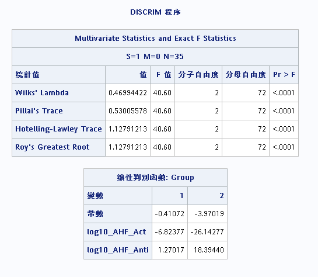

```{r setup, include=FALSE}
library(svglite)
if (knitr::is_html_output()) {
    knitr::opts_chunk$set(
	echo = FALSE,
	fig.dim = c(7, 4),
	message = FALSE,
	warning = FALSE,
	comment = "",
	dev='svg',
	out.width = "100%"
)
} else {
    library(showtext)
    knitr::opts_chunk$set(echo = FALSE,
                          message=FALSE,
                          warning=FALSE,
                          comment = "",
                          out.width = '70%',
                          fig.showtext = T)
}
library(readr)
library(tidyverse)
library(knitr)
library(kableExtra)
library(mat2tex)
theme <- theme_light() +
    theme(axis.text.x = element_text(size = 7, face = "plain", angle = 30),
               axis.text.y = element_text(size = 7, face = "plain"),
               axis.title.x = element_text(size = 9, face = "bold"),
    axis.title.y = element_text(size = 9, face = "bold"))
```

## 11.1
+ a) $~~~~\hat{y} = (\bar{x_1} - \bar{x_2})^{\prime}S^{-1}_{pooled}x = \hat{a}^{\prime}x$<br>
     $~~~~~~~S^{-1}_{pooled} = \begin{bmatrix} 2 & -1 \\ -1 & 1 \end{bmatrix}$<br>
     $~~~~~~~\begin{bmatrix} -2 & -2 \end{bmatrix}\begin{bmatrix} 2 & -1 \\ -1 & 1 \end{bmatrix}x = -2x_1$
+ b) $~~~~\hat{m} = \frac{1}{2}(\hat{y_1}+\hat{y_2}) = -8$<br>
     $~~~~~~-2(2) = -4 > -8 \Rightarrow assign~to~\pi_1$

## 11.4
+ a) $~~~~(\frac{c(1\mid 2)}{c(2\mid 1)})(\frac{p_2}{p_1}) = 0.5$<br>
     $~~~~~~~\Rightarrow assign~to~\pi_1~if~\frac{f_1(x)}{f_2(x)}\geq0.5,~otherwise~assign~to~\pi_2$
+ b) $~~~~\frac{f_1(x)}{f_2(x)} = \frac{0.3}{0.5} = 0.6 > 0.5\Rightarrow assign~to~\pi_1$

## 11.19
+ b) $~~~~\hat{y_0} = \hat{a}^{\prime}x_0 = -0.33x_1+0.67x_2$<br>
     $~~~~~~~where~\hat{m} = 4.5$<br>
     $~~~~~~~assign~to~\pi_1~if~-0.33x_1+0.67x_2-4.5\geq 0,~otherwise~assign~to~\pi_2$

| | $\pi_1$ | | | $\pi_2$ | |
|---|---|---|---|---|---|
|obs.| $−0.33x_1+0.67x_2−4.5$ | class. | obs. | $−0.33x_1+0.67x_2−4.5$ | class.|
| 1 | 2.83 | $\pi_1$ | 1 | -1.5 | $\pi_2$ |
| 2 | 0.83 | $\pi_1$ | 2 | 0.5 | $\pi_1$ |
| 3 | -0.17 | $\pi_2$ | 3 | -2.5 | $\pi_2$ |

+ c) $~~~~D^2_i(x) = (x - \bar{x_i})^{\prime}S^{-1}_{pooled}(x - \bar{x_i})$

|  | | $\pi_1$ | | | $\pi_2$ | | |
|---|---|---|---|---|---|
|obs.| $D^2_1$ | $D^2_2$ | class. | obs. | $D^2_1$ | $D^2_2$ | class.|
| 1 | 1.33 | 7 | $\pi_1$ | 1 | 4.33 | 1.33 | $\pi_2$ |
| 2 | 1.33 | 3 | $\pi_1$ | 2 | 0.33 | 1.33 | $\pi_1$ |
| 3 | 1.33 | 1 | $\pi_2$ | 3 | 6.33 | 1.33 | $\pi_2$ |


## 11.32
```{r}
hemo <- readr::read_table2("T11-8.DAT", col_names = FALSE,
                           col_types = cols(X1 = col_character())
                           ) %>%
    set_names(c("group", "activity", "antigen"))
```

### (a) Bivariate plot
```{r}
pl <- ggplot(hemo) +
    geom_point(aes(x=activity, y=antigen, shape=group, color=group))+
    labs(color="Group",shape="Group",
         x = expression('log'[10]*'(AHF activity)'),
         y = expression('log'[10]*'(AHF antigen)')
         )
pl + theme_light()
```

The bivariate plot doesn't seem to fit well into a bivariate normal distribution.

#### SAS `pool=test`

```{r out.width=c("40%","70%"), fig.show='hold'}


```

Test not significant. The covariance of the two groups are assumed to be equal.

#### SAS `manova`

```{r out.width="50%"}

```

Means of two groups are not equal.


### (b) linear disciminant function
```{r}
x1_bar <- hemo[hemo$group == "1",2:3] %>% colMeans()
x2_bar <- hemo[hemo$group == "2",2:3] %>% colMeans()
sum <- x1_bar + x2_bar

S1 <- hemo[hemo$group == "1", 2:3] %>% cov()
S2 <- hemo[hemo$group == "2", 2:3] %>% cov()

n1 <- hemo[hemo$group == "1",] %>% nrow
n2 <- hemo[hemo$group == "2",] %>% nrow

S_pool <- ((n1 - 1)*S1 + (n2 - 1)*S2)/(n1 + n2 - 2)

a <- solve(S_pool) %*% (x1_bar - x2_bar)
cutoff <- .5 * (x1_bar - x2_bar) %*% solve(S_pool) %*% (x1_bar + x2_bar)
```

\begin{equation}
\begin{split}
\hat{y} &= (\bar{\bm{x}}_1 - \bar{\bm{x}}_2)^T S_{pool}^{-1} ~ \bm{x}_0 \\
&= \bm{a}^T \bm{x}_0 \\
&= \begin{pmatrix}
`r a[1] %>% round(3)` & `r a[2] %>% round(3)`
\end{pmatrix}
\bm{x}_0
\end{split}
(\#eq:ref-1)
\end{equation}

Then allocate $\bm{x}_0$ to $\pi_1$ if:

\begin{equation}
\begin{split}
\hat{y} &\geq \frac{1}{2} (\bar{\bm{x}}_1 - \bar{\bm{x}}_2)^T S_{pool}^{-1} ~ (\bar{\bm{x}}_1 + \bar{\bm{x}}_2) \\
&= \frac{1}{2} \bm{a}^T (\bar{\bm{x}}_1 + \bar{\bm{x}}_2)
= `r cutoff %>% round(3)`
\end{split}
(\#eq:ref-2)
\end{equation}

where, $\bar{\bm{x}}_1 =\begin{pmatrix}
`r x1_bar[1] %>% round(3)`  \\
`r x1_bar[2] %>% round(3)` 
\end{pmatrix}, 
\bar{\bm{x}}_2 = \begin{pmatrix}
`r x2_bar[1] %>% round(3)`  \\
`r x2_bar[2] %>% round(3)` 
\end{pmatrix}$

The linear discriminant function is:

\begin{equation}
`r round(a[1],3)` x_{0,1} `r round(a[2],3)` x_{0,1} + `r -round(cutoff,3)`
(\#eq:discri-1)
\end{equation}

```{r}
library(MASS)
lda_hold <- lda(formula = group ~ activity + antigen, 
                CV=TRUE, prior=c(1,1)/2, data = hemo)

confus_mt_hold <- table(hemo$group, lda_hold$class, 
      dnn = c('Actual Group','Predicted Group'))
```

The confusion matrix constructed with the holdout procedure is
```{r}
confus_mt_hold %>% 
    knitr::kable(row.names = T, 
                 format = "markdown", align = "c",
                 col.names = c("Group 1", "Group 2"))
```

, and the estimated error rate is **`r (confus_mt_hold[1,2] + confus_mt_hold[2,1]) / sum(confus_mt_hold)`**.

The misclassified observations are **No. `r which(hemo$group != lda_hold$class %>% paste(sep=", "))`**, labeled "M" in the plot below.
```{r misclassified}
index <- which(hemo$group != lda_hold$class)
pl +
    geom_text(aes(x=activity, y=antigen, label = "M"),
              data = hemo[index,],
              size = 2, nudge_x = 0.01) + theme_light()
```


### (c)

```{r}
x0 <- c(-0.112 , -0.279)
y0 <- (t(a) %*% x0)[1,1]
```

By eq. \@ref(eq:ref-1) and eq. \@ref(eq:ref-2), $\hat{y}_0 = `r y0 %>% round(3)` \geq `r cutoff %>% round(3)`$. Hence, it is allocated to **Group 1**.


### (d)
```{r}
library(mvtnorm)
f1_x0 <- dmvnorm(x = x0, mean = x1_bar, sigma = S1)
f2_x0 <- dmvnorm(x = x0, mean = x2_bar, sigma = S2)
```

Classification rule based on posterior probabilities is equivalent to classification rule based on minimizing TPM.

Since the prior probabilities are assumed to be equal, the posterior probabilities are calculated as:

\begin{equation}
\begin{split}
p(\pi_1|\bm{x}_0) &= \frac{ f_1(\bm{x}_0)}{f_1(\bm{x}_0) + f_2(\bm{x}_0)} = `r f1_x0/(f1_x0 +f2_x0) %>% round(3)` \\
p(\pi_2|\bm{x}_0) &= 1 - p(\pi_1|\bm{x}_0)
= `r f2_x0/(f1_x0 +f2_x0) %>% round(3)`
\end{split}
(\#eq:posterior)
\end{equation}

, where the densities $f_1(\bm{x}_0)$ and $f_2(\bm{x}_0)$ are assumed to be normal and are estimated using $\bar{\bm{x}}_1, \bar{\bm{x}}_2, \bm{S}_1, \bm{S}_2$.

By $p(\pi_1|\bm{x}_0) > p(\pi_2|\bm{x}_0)$, $\bm{x}_0$ is classified as **Group 1**. 


### (e)

By eq. \@ref(eq:ref-1), eq. \@ref(eq:ref-2), and [c](#c), the linear discriminant score is calculated as $\hat{y}_0 - \frac{1}{2} (\bar{\bm{x}}_1 - \bar{\bm{x}}_2)^T S_{pool}^{-1} ~ (\bar{\bm{x}}_1 + \bar{\bm{x}}_2) = `r (y0 - cutoff) %>% round(3)`$.


### (f)
Assume $p_1 = 0.75$ and $p_2 = 0.25$, then allocate $\bm{x}_0$ to $\pi_1$ if:

\begin{equation}
\begin{split}
\hat{y} &\geq \frac{1}{2} (\bar{\bm{x}}_1 - \bar{\bm{x}}_2)^T S_{pool}^{-1} ~ (\bar{\bm{x}}_1 + \bar{\bm{x}}_2) + 
ln (\frac{c(1|2) p_2}{c(2|1) p_1}) \\
&= \frac{1}{2} \bm{a}^T (\bar{\bm{x}}_1 + \bar{\bm{x}}_2) + ln (\frac{0.25}{0.75})
= `r (cutoff + log(0.25/0.75)) %>% round(3)`
\end{split}
(\#eq:uneq-prior)
\end{equation}

where, $\bar{\bm{x}}_1 =\begin{pmatrix}
`r x1_bar[1] %>% round(3)`  \\
`r x1_bar[2] %>% round(3)` 
\end{pmatrix}, 
\bar{\bm{x}}_2 = \begin{pmatrix}
`r x2_bar[1] %>% round(3)`  \\
`r x2_bar[2] %>% round(3)` 
\end{pmatrix}$

The linear discriminant function is:

\begin{equation}
`r round(a[1],3)` x_{0,1} `r round(a[2],3)` x_{0,1} + `r -round(cutoff + log(0.25/0.75), 3)`
(\#eq:discri-2)
\end{equation}


```{r}
lda_hold <- lda(formula = group ~ activity + antigen, 
                CV=TRUE, prior=c(0.75,0.25), data = hemo)

confus_mt_hold <- table(hemo$group, lda_hold$class, 
      dnn = c('Actual Group','Predicted Group'))
```

The confusion matrix constructed with the holdout procedure is
```{r}
confus_mt_hold %>% 
    knitr::kable(row.names = T, 
                 format = "markdown", align = "c",
                 col.names = c("Group 1", "Group 2"))
```

, and the estimated error rate is **`r (confus_mt_hold[1,2] + confus_mt_hold[2,1]) / sum(confus_mt_hold)`**.

The misclassified observations are **No. `r which(hemo$group != lda_hold$class %>% paste(sep=", "))`**, labeled "M" in the plot below.
```{r misclassified2}
index <- which(hemo$group != lda_hold$class)
pl +
    geom_text(aes(x=activity, y=antigen, label = "M"),
              data = hemo[index,],
              size = 2, nudge_x = 0.01) + theme_light()
```


### (g)

```{r}
x0 <- c(-0.112 , -0.279)
y0 <- (t(a) %*% x0)[1,1]
dis_score <- y0 - (cutoff + log(0.25/0.75))
```

By eq. \@ref(eq:ref-1) and eq. \@ref(eq:uneq-prior), $\hat{y}_0 - [ \frac{1}{2} \bm{a}^T (\bar{\bm{x}}_1 + \bar{\bm{x}}_2) + ln (\frac{0.25}{0.75}) ] = `r dis_score %>% round(3)` > 0$. Hence, it is allocated to **Group 1**.


### (h)
```{r}
library(mvtnorm)
f1_x0 <- dmvnorm(x = x0, mean = x1_bar, sigma = S1)
f2_x0 <- dmvnorm(x = x0, mean = x2_bar, sigma = S2)
p1 <- 0.75
p2 <- 0.25
```

Classification rule based on posterior probabilities is equivalent to classification rule based on minimizing TPM.

The posterior probabilities are calculated as:

\begin{equation}
\begin{split}
p(\pi_1|\bm{x}_0) &= \frac{ p_1 f_1(\bm{x}_0)}{p_1 f_1(\bm{x}_0) + p_2 f_2(\bm{x}_0)} = `r p1*f1_x0/(p1*f1_x0 + p2*f2_x0) %>% round(3)` \\
p(\pi_2|\bm{x}_0) &= 1 - p(\pi_1|\bm{x}_0)
= `r p2*f2_x0/(p1*f1_x0 + p2*f2_x0) %>% round(3)`
\end{split}
(\#eq:posterior2)
\end{equation}

, where the densities $f_1(\bm{x}_0)$ and $f_2(\bm{x}_0)$ are assumed to be normal and are estimated using $\bar{\bm{x}}_1, \bar{\bm{x}}_2, \bm{S}_1, \bm{S}_2$.

By $p(\pi_1|\bm{x}_0) > p(\pi_2|\bm{x}_0)$, $\bm{x}_0$ is classified as **Group 1**.

### (i)

By eq. \@ref(eq:ref-1), eq. \@ref(eq:uneq-prior), and [g](#g), the linear discriminant score is calculated as $\hat{y}_0 - [ \frac{1}{2} \bm{a}^T (\bar{\bm{x}}_1 + \bar{\bm{x}}_2) + ln (\frac{0.25}{0.75}) ] = `r y0 - (cutoff + log(0.25/0.75)) %>% round(3)`$.


### (j)
```{r out.width="50%", fig.show='hold'}
fc_eq <- function(x) -a[1]*x/a[2] + cutoff[1,1]/a[2] 
fc_uneq <- function(x) -a[1]*x/a[2] + (cutoff[1,1] + log(0.25/0.75))/a[2] 

    
pl+stat_function(fun = fc_eq) +
    geom_point(aes(x=-0.112 , y=-0.279))+
    geom_text(aes(x=-0.112 , y=-0.279, 
                  label="(-0.112 , -0.279)"),
              nudge_x=0.09, size=3) +
    labs(title="Equal Prior Probabilities")+
    xlim(c(-0.75,0.25))+
    ylim(c(-0.50, 0.5))+ theme_light()

pl+stat_function(fun = fc_uneq)+
    geom_point(aes(x=-0.112 , y=-0.279))+
    geom_text(aes(x=-0.112 , y=-0.279, 
                  label="(-0.112 , -0.279)"),
              nudge_x=0.09, size=3) +
    labs(title="P1 = 0.75, P2 = 0.25")+
    xlim(c(-0.75,0.25))+
    ylim(c(-0.50, 0.5))+ theme_light()
```

When the prior probability $p_1$ changes from 0.5 to 0.75, the discriminant function shifts parallelly to the upper-left direction.