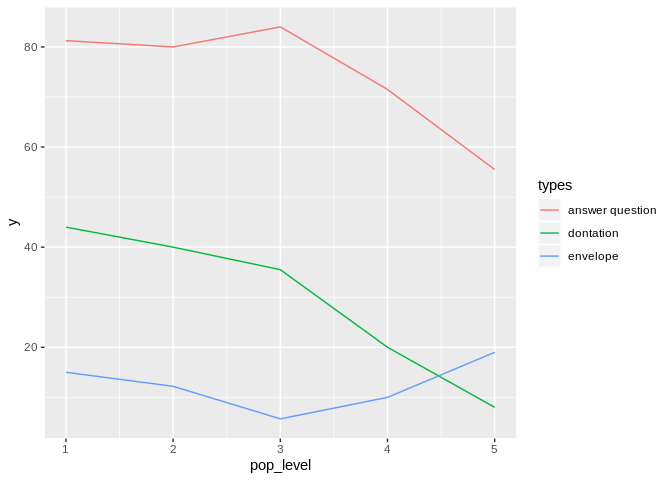
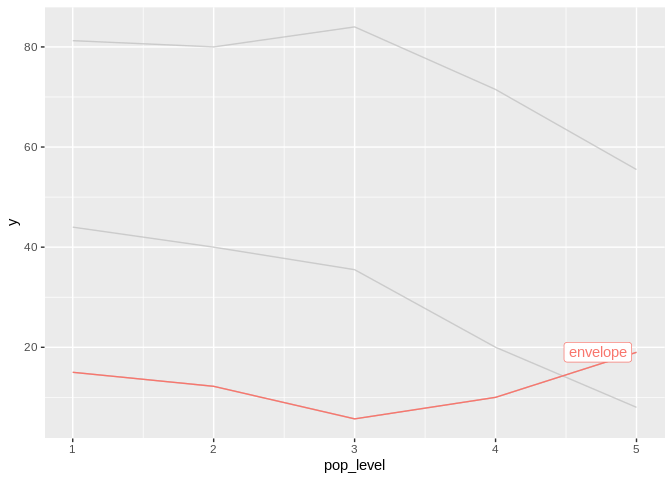

gghighlight-issue.R
================
liao
Fri Jan 4 12:03:59 2019

``` r
library(ggplot2)
library(gghighlight)
library(dplyr)

poplev_helping <- readr::read_csv("poplev-helping2.csv") %>% 
  tidyr::gather("types", "y", -pop_level)
```

    ## Parsed with column specification:
    ## cols(
    ##   pop_level = col_integer(),
    ##   `answer question` = col_double(),
    ##   dontation = col_double(),
    ##   envelope = col_double()
    ## )

``` r
poplev_helping[seq(from=1, to=15, by=3),]
```

    ## # A tibble: 5 x 3
    ##   pop_level types               y
    ##       <int> <chr>           <dbl>
    ## 1         1 answer question  81.2
    ## 2         4 answer question  71.5
    ## 3         2 dontation        40  
    ## 4         5 dontation         8  
    ## 5         3 envelope          5.7

``` r
p <- ggplot(poplev_helping,
            aes(x = pop_level, color = types)) +
  geom_line(aes(y = y))
p
```



``` r
p + gghighlight(types %in% c('donation', 'envelope'))
```

    ## Warning: Tried to calculate with group_by(), but the calculation failed.
    ## Falling back to ungrouped filter operation...

    ## label_key: types


