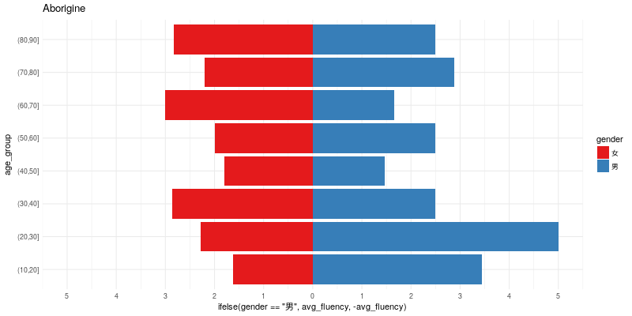

```{r setup, include=FALSE}
knitr::opts_chunk$set(
	echo = FALSE,
	message = FALSE,
	warning = FALSE
)
```


```{r results='hide', message=FALSE, warning=FALSE, paged.print=FALSE}
source("shape.R")
```


```{r include=FALSE}
animation::saveGIF(for (i in colnames(sp)[c(2,3)]) plot(sp[i]),
        movie.name = "plot.gif", img.name = "plott",
        ani.dev = function(...){png(res=130*1.2,...)})
```

```{r, fig.width=8}
knitr::include_graphics("plot.gif")
```

```{r}

```

